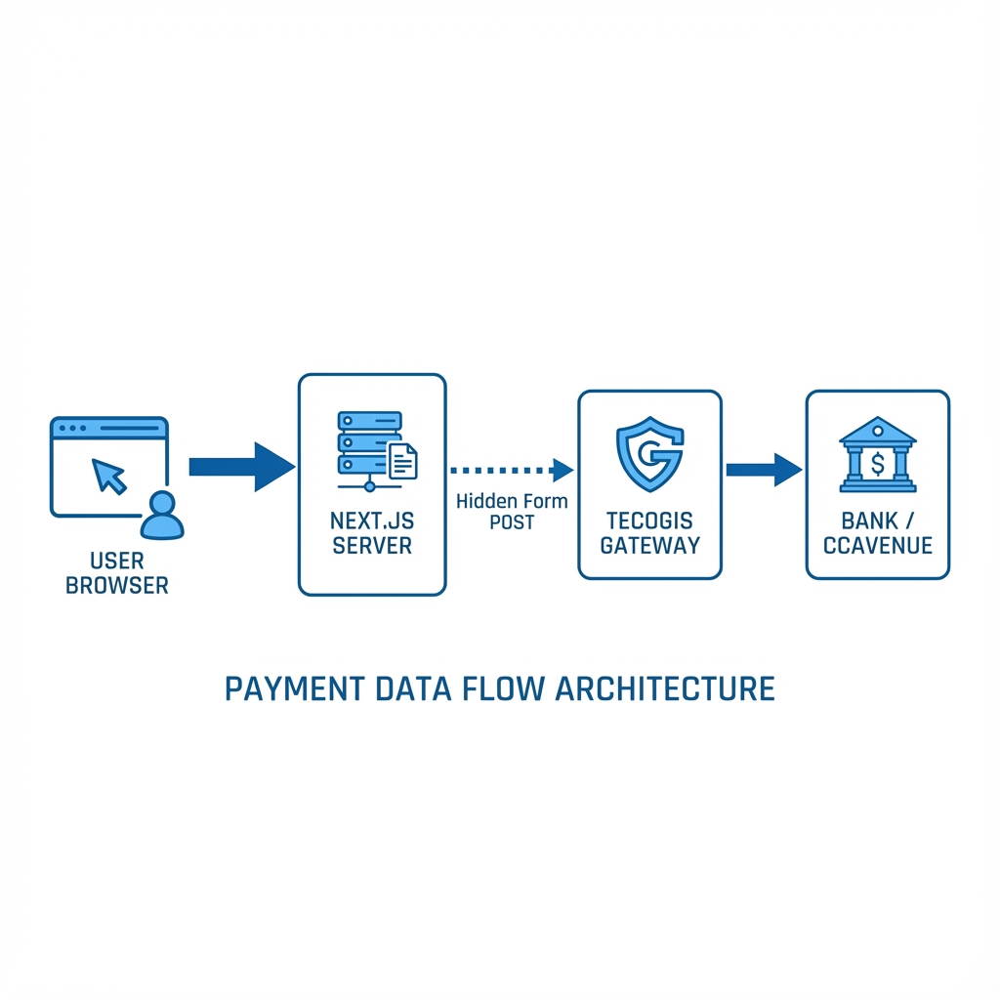
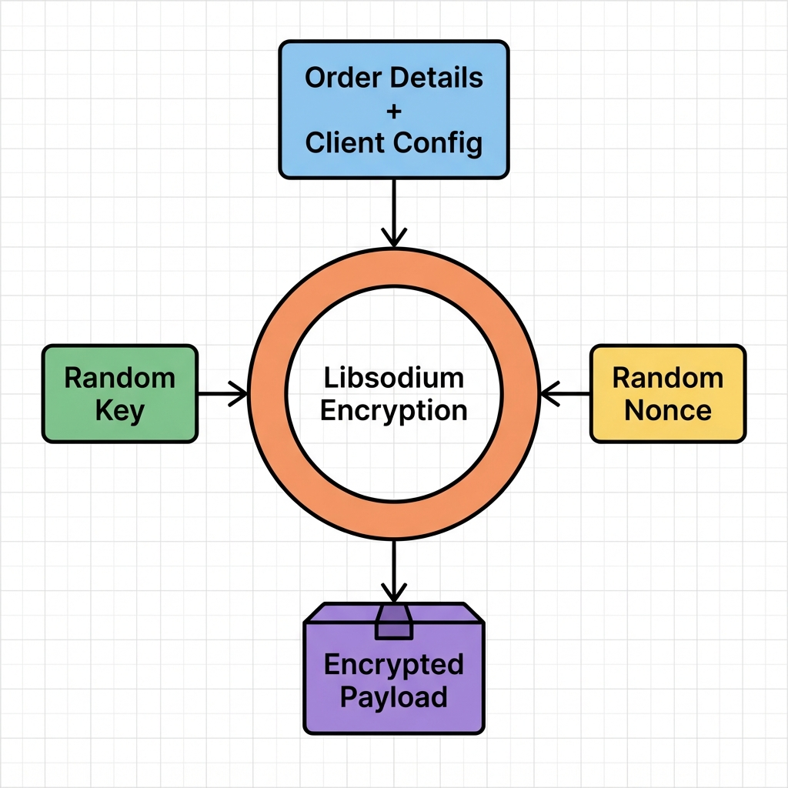

# Tecogis Payment Architecture & Working Mechanism

This document provides a technical breakdown of the payment integration developed for Vishwa Lifestyle, designed to help new developers understand the "Middle Layer" architecture pattern used.

## 1. High-Level Architecture

The integration uses a **Client-Side Redirection Pattern**. Unlike modern APIs (like Stripe) that use direct API calls, this legacy-style integration requires the user's browser to "submit a form" to hand over control to the Payment Gateway.

### Components

1.  **User Browser**: The starting point. The user clicks "Pay".
2.  **Next.js Server (Our API)**: Acts as the **Encryption Engine**. It does NOT talk to the bank directly. It only prepares the secure data package.
3.  **Tecogis Gateway**: The middleman. It receives the encrypted package, decrypts it, and forwards the transaction to the actual bank.
4.  **Bank / CCAvenue**: The final entity that processes the credit card/UPI transaction.

---

## 2. Core Security Mechanism: "The Sealed Envelope"

The most complex part of this integration is how we secure the data. We don't send `amount=100` plainly. We create a "Sealed Envelope" (Encrypted Payload).

### The Algorithm: Sodium (`libsodium`)
We use **ChaCha20-Poly1305** authentication encryption. This is highly secure and faster than mostly used AES.

### The "Dynamic Key" Approach
This is the unique part of Tecogis.
*   **Standard Gateways:** You have 1 static `SECRET_KEY` in your `.env` file.
*   **Tecogis Integration:** We generate a **BRAND NEW KEY** for *every single customer*.
    1.  User clicks Pay.
    2.  We generate `Key_123`.
    3.  We lock the data with `Key_123`.
    4.  We send **BOTH** the `Locked_Data` AND `Key_123` to Tecogis.
    5.  Tecogis uses the key to unlock the data and process it.

---

## 3. Detailed Step-by-Step Flow

### Phase 1: Initiation (On our Server)
**File: `app/api/payment/initiate/route.ts`**

1.  **Receive**: App sends `Order ID: #555` and `Amount: ₹1000`.
2.  **Generate**:
    *   `Key` (32 random bytes)
    *   `Nonce` (24 random bytes - "Number used ONCE")
3.  **Pack**: Combine all data into a pipe-separated string:
    `agnihotra|#555|1000|http://return-url|John|Doe|...`
4.  **Encrypt**: Use `libsodium` to encrypt this string.
5.  **Return**: Send the `EncryptedString`, `Key`, and `Nonce` back to the frontend.

### Phase 2: Handoff (In Browser)
**File: `app/checkout/page.tsx`**

1.  **Create Invisible Form**: Javascript creates a `<form>` element that is not visible to the user.
2.  **Fill Data**: Puts the encrypted data into hidden inputs: `<input type="hidden" name="PaymentData" ... />`.
3.  **Auto-Submit**: The script calls `form.submit()`.
4.  **Redirect**: The browser navigates to `https://www.tecogis.com/...`.
    *   *Note*: We had to update `middleware.ts` (CSP) to allow this redirection, essentially telling the browser "It is safe to submit data to tecogis.com".

### Phase 3: Bank Processing (External)
1.  Tecogis receives the form.
2.  Unlocks data using the key.
3.  Validates the Merchant ID (`agnihotra`).
4.  Redirects user to CCAvenue/Bank page.
5.  User pays via UPI/Card.

### Phase 4: The Return (Callback)
**File: `app/api/payment/callback/route.ts`**

1.  Bank finishes -> Sends user back to `vishwalifestyle.com`.
2.  **Current Status**: We receive a POST request with the transaction result.
3.  **Future Work**: We need to decrypt this response to update our database (currently pending the decryption logic from the client).

## 4. Why did we do it this way?
(For Juniors)

*   **Security requirement:** We cannot expose the `MerchantID` or Raw Data in the frontend code.
*   **Protocol requirement:** Tecogis *requires* a Form POST. We cannot do a simple `fetch()` call because `fetch()` happens in the background. The **User** must physically navigate to the payment page.
*   **Middleware:** Next.js (by default) blocks cross-site form submissions for security. We had to explicitly whitelist Tecogis in our Content Security Policy to prevent the browser from blocking the "unsafe" redirect.
